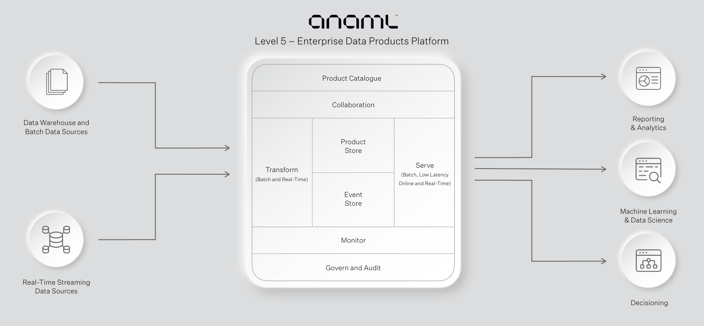

# The Platform for Enterprise Data Products

**Anaml is the easiest and most powerful way to discover, create and
operationalise trusted Data Products for Machine Learning, Analytics and
Decisioning.**



## Anaml Overview

Our mission is to democratise access to trusted data for technical business teams: data science/ ML/AI, analytics, decisioning, risk and many others:

* Anaml makes Data Products (features, metrics and attributes) easy to create (parametric, low code, or full code), discover and compose into datasets that can be served into production for offline batch, online and real-time use-cases
* Anaml took the concept of a ‘feature store’ from data science and generalised it for the entire enterprise, Anaml caters to: features, metrics and materialisations for the entire organisation
* Anaml removes the technical barriers: no-code, low-code and full code transformations

## Getting Started

### Docker

The easiest and quickest way to try Anaml is running locally with Docker:

```bash
git clone https://github.com/simple-machines/anaml.git
cd anaml
docker compose up -d
```

You should now be able browse to Anaml at http://localhost:8081.

The default username/password is `admin@anaml.io` / `test password`. These can be changed in the `docker-compose.yml` file or through environment variables.

#### Demo Data

If you would like to setup some demonstration data and definitions run the following command:

```bash
./docker-demo-setup.sh
```

#### Adding your own data

You can add your own data into the docker container inside the `demo-data/raw` directory. Each table of data should be in it's own directory.

For example to add data on orders:
```
mkdir -p demo-data/raw/orders
cp <orders data file(s)> demo-data/raw/orders
```

In Anaml create a new _Table_, choose `local_csv` or `local_orc` as the _Source_ and set the path as `orders`. You should now be able to preview the table.

#### Clean-up

If you would like to reset the environment and database:

```bash
docker compose down
rm demo-setup/terraform.tfstate
docker volume rm pg-data
```

### Terraform

If you would like to install with multiple users, or with a more compute resources you can use our terraform scripts to deploy to AWS or GCP.
